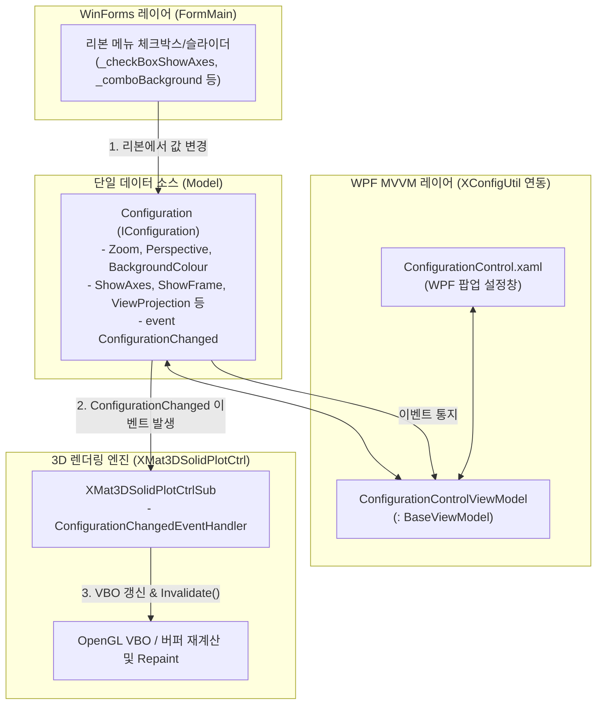

# [5편] WinForms 장비 개발자를 위한 XConfigUtil & Configuration 재사용 아키텍처

> **WinForms의 직관성과 WPF MVVM의 재사용성을 결합하여, 새 프로젝트마다 반복되던 파라미터 UI 개발 비용을 '0'으로 만든 아키텍처 노하우**

---

## 1. 배경: 산업용 WinForms 프로그램과 WPF의 공존

반도체 및 자동화 검사 장비 제어 소프트웨어는 여전히 **C# Windows Forms**가 주류를 이룹니다. 직관적인 이벤트 드리븐 구조, 가벼운 실행 속도, 안정적인 P/Invoke 드라이버 연동 덕분입니다.

하지만 장비의 기능이 복잡해지면서 다음과 같은 문제가 발생합니다:
* 파트 이름 변경, 어셈블리 생성 등 **텍스트 입력창이 필요할 때마다 WinForms 폼(`FormRename.cs` 등)을 계속 새로 만들어야 하는 중복**.
* 3D 카메라 줌, 원근감, 투영 모드, 배경색, 축 표시 등 **수십 개의 3D 파라미터 설정 UI를 새로운 장비 프로젝트를 만들 때마다 매번 다시 배치하고 이벤트를 연결해야 하는 피로감**.

**`XConfigUtil`**은 이 문제를 해결하기 위해 고안된 **WPF 기반 공통 MVVM 및 시스템 유틸리티 라이브러리**입니다.

---

## 2. WinForms 개발자가 체감하는 MVVM의 장벽과 해법

### 1) 왜 WinForms 개발자에게 MVVM이 어렵게 느껴질까?
* **명령형(내가 직접 바꿈) vs 선언형(남이 알아서 감지함)**:
  WinForms는 `txtPart.Text = "Chuck";`나 `panel.Visible = chk.Checked;`처럼 한 줄로 직관적입니다. 반면 MVVM은 변수를 바꾸고 `NotifyPropertyChanged`라는 통지 단계를 거쳐 프레임워크가 뒤에서 화면을 바꾸는 **간접적인 구조**를 가집니다.
* **F12 코드 추적의 단절**:
  WinForms는 버튼 클릭 시 이벤트 핸들러로 바로 점프하지만, MVVM은 XAML의 `{Binding Command}` 문자열로 엮여 있어 런타임 바인딩 엔진을 거치므로 흐름 파악이 끊겨 보입니다.
* **과도한 보일러플레이트**:
  단순히 불리언 값에 따라 컨트롤을 숨기려 해도 `ViewModel 속성` + `NotifyPropertyChanged` + `ValueConverter 클래스` + `XAML 리소스 등록` 등 4~5단계를 거쳐야 합니다.

### 2) 최신 개발 환경에서의 해법: AI 페어 프로그래밍과의 결합
이러한 MVVM의 기계적인 코드 작성(보일러플레이트, XAML 태그, ValueConverter)은 **AI에게 맡기고**, 엔지니어는 **"순수 비즈니스 로직과 화면 간 완벽한 데이터 동기화라는 MVVM의 과실만 취하는 것"**이 최신 개발 방식의 핵심입니다.

---

## 3. `Configuration` 단일 진실 공급원(SSOT) 아키텍처

`XMat3DSolidPlot`의 가장 뛰어난 설계는 **`Configuration` 객체 하나가 3D 뷰어와 메인 화면 전체의 단일 데이터 소스(Single Source of Truth)로 동작한다는 점**입니다.



### 실시간 연쇄 반응 흐름
1. **사용자 조작**: 사용자가 WPF 환경설정 팝업창에서 배경색이나 축 표시를 변경.
2. **ViewModel 갱신**: ComboBox 바인딩을 통해 `ConfigurationControlViewModel` 속성이 변경됨.
3. **Model 통지**: `Configuration.cs`의 `ConfigurationChanged?.Invoke(...)` 이벤트 발송.
4. **OpenTK 렌더러 즉시 반영**: `XMat3DSolidPlotCtrlSub`가 이벤트를 받아 정점 버퍼 재빌드(`RefreshVertexBuffers`) 및 `Invalidate()` 실행 → **3D 뷰포트가 60FPS로 즉시 갱신**.
5. **메인 화면 동기화**: `FormMain`의 리본 메뉴 컨트롤들도 동일한 `_modelConfig` 인스턴스를 공유하므로 화면 간 불일치가 완벽히 차단됨.

---

## 4. 다른 컨트롤 제작 시 100% 재활용 가능한 '표준 4단계 청사진'

이 패턴의 진정한 강점은 **다른 산업용 컨트롤(카메라, 모터, 조명, 비전 검사기)을 만들 때도 100% 복사하듯 재활용할 수 있다는 점**입니다.

```
[새 컨트롤 프로젝트]
 ├── 1. Model\I...Configuration.cs  → [파라메터 데이터 + ConfigurationChanged 이벤트 + Load/Save]
 ├── 2. Control\MyCustomCtrl.cs     → [이벤트 수신 시 화면/장비 즉시 갱신]
 ├── 3. View\ConfigControl.xaml     → [XConfigUtil 기반 WPF 탭/슬라이더 UI]
 └── 4. Exports.cs                  → [Show...ConfigurationDialog(config, handle) 팝업 진입점]
```

### 대표적인 재활용 적용 분야

| 분야 | 컨트롤 명칭 | Configuration 항목 예시 |
| :--- | :--- | :--- |
| **2D 머신비전** | `CameraViewCtrl` | 노출 시간(Exposure), 게인(Gain), 프레임 레이트, 격자선(Grid), 줌/팬 비율 |
| **모션 제어** | `MotionStageCtrl` | 축별 조그 속도, 가감속 시간, 소프트 리미트 범위, 원점 오프셋 |
| **산업용 조명** | `LightControllerCtrl` | 채널별 밝기 값(0~255), 스트로브 펄스 폭, 통신 포트/보레이트 |
| **비전 검사 알고리즘** | `InspectRecipeCtrl` | 이진화 임계값(Threshold), 필터 커널 크기, 검출 최소/최대 면적, 공차(Tolerance) |

---

## 5. 결론: 턴키(Turn-Key) 컴포넌트화가 가져온 생산성 혁신

* **새 프로젝트의 파라미터 UI 개발 비용 '0'**:
  새로운 검사 프로그램을 개발할 때, 카메라 줌 슬라이더나 모터 설정창을 일일이 새로 배치할 필요 없이 DLL 참조와 `Exports.ShowSolidConfigurationDialog()` 한 줄로 완성형 설정창이 따라옵니다.
* **설정 직렬화(저장/복원) 규격 자동 통일**:
  `IConfiguration.Save()` / `Load()` 인터페이스를 통해 모든 프로젝트에서 일관된 파일 포맷으로 환경을 영속화합니다.
* **장비 전반의 통일된 UX**:
  사내에서 개발하는 모든 장비 소프트웨어의 3D 조작 및 설정 창이 동일한 디자인과 단축키로 동작하여 현장 오퍼레이터의 교육 비용을 획기적으로 줄여줍니다.
