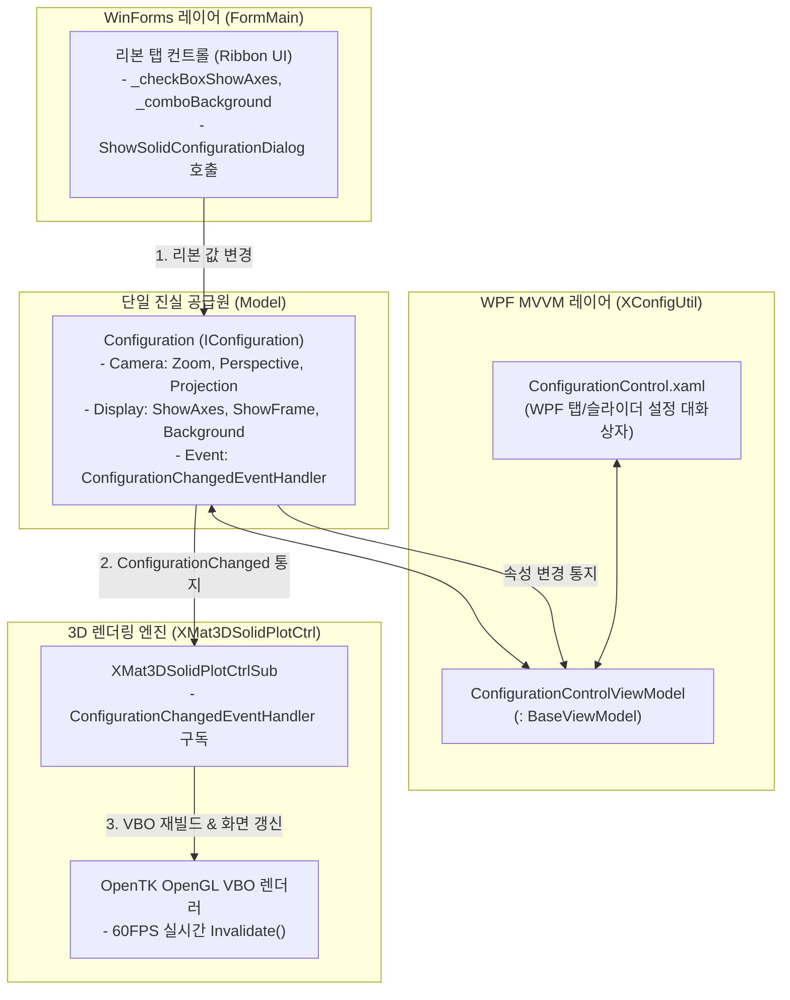

# Configuration & XConfigUtil 아키텍처 (Configuration Architecture)

> **단일 진실 공급원(SSOT) 모델 기반의 실시간 3자 동기화와 턴키(Turn-Key) 컴포넌트 재사용 아키텍처 사양**

---

## 1. 아키텍처 개요 (Overview)

`XMat3DSolidPlot`과 `XMat3DSolidWork`의 핵심 설계 철학 중 하나는 **"모든 3D 뷰 및 환경 파라미터는 단 하나의 모델(`Configuration`)에서 관리되고, 모든 UI와 렌더러는 이 모델을 바라본다"**는 것입니다.

이를 통해 WinForms 리본 메뉴, WPF 설정 팝업창, OpenTK OpenGL 렌더러가 서로를 직접 참조하지 않고도 실시간으로 완벽하게 상태를 동기화합니다.



---

## 2. `IConfiguration` 모델 사양 (Model Specification)

`XMat3DSolidPlot.Model.IConfiguration`은 3D 뷰포트의 모든 시각적 상태와 수학적 파라미터를 추상화합니다.

### 1) 주요 관리 프로퍼티

| 카테고리 | 속성명 | 타입 | 기본값 | 설명 |
| :--- | :--- | :--- | :--- | :--- |
| **카메라** | `Zoom` | `int` | `100` | 카메라 줌 배율 (1 ~ 500) |
| | `Perspective` | `float` | `100.0f` | 원근 투영 화각 및 초점 거리 |
| | `ViewProjection` | `ViewProjection` | `ThreeDimensional` | 3D 원근, 정면(Front), 측면(Side), 평면(Top) |
| **좌표계 & 축** | `ShowAxes` | `bool` | `true` | 월드 좌표계 3축(X, Y, Z) 표시 여부 |
| | `ShowAxesTitles` | `bool` | `false` | 축 명칭 텍스트 라벨 표시 |
| | `ShowMiniAxes` | `bool` | `true` | 좌측 상단 인터랙티브 미니 축 표시 |
| | `ShowBaseCornerAxes` | `bool` | `true` | 베이스 블록 코너 기준 축 표시 |
| **바운딩 & 프레임**| `ShowFrame` | `bool` | `true` | 장비 작업 공간 바운딩 박스 와이어프레임 |
| | `FrameColour` | `string` | `"White"` | 바운딩 프레임 라인 색상 |
| **스타일 & 테마** | `BackgroundColour` | `string` | `"Black"` | 3D 뷰포트 배경색 (`BlanchedAlmond` 등) |
| | `LabelFontSize` | `int` | `10` | 3D 텍스트 렌더링 폰트 크기 |
| | `WorkOnFace` | `bool` | `false` | 솔리드 표면 클릭 스케치 모드 활성화 |

### 2) 이벤트 통지 메커니즘
```csharp
public delegate void ConfigurationChangedEventHandler(ConfigurationItem configurationItem);

public interface IConfiguration
{
    event ConfigurationChangedEventHandler ConfigurationChanged;
    // ... 프로퍼티 정의 ...
}
```
속성의 `set` 블록이 실행될 때마다 `ConfigurationChanged?.Invoke(ConfigurationItem.xxx)`가 호출되어, 구독자들에게 어떤 항목이 변경되었는지 세분화된 열거형(`ConfigurationItem`)으로 전달합니다.

---

## 3. OpenTK 3D 렌더러 반응 파이프라인

`XMat3DSolidPlotCtrlSub`는 컨트롤 생성 시 `IConfiguration.ConfigurationChanged`를 구독하여 변경 항목에 맞춰 최적화된 최소 연산만 수행합니다.

```csharp
public void ConfigurationChangedEventHandler(ConfigurationItem configurationItem)
{
    try
    {
        switch (configurationItem)
        {
            // 1. 기하 좌표계 및 공간 바운딩 재계산
            case ConfigurationItem.ShowAxes:
            case ConfigurationItem.ShowCoordPlanes:
            case ConfigurationItem.ShowFrame:
            case ConfigurationItem.ViewProjection:
                ConfigureSolidWorkspace(_solidWorkspaceWidth, _solidWorkspaceHeight, _solidWorkspaceMinZ, _solidWorkspaceMaxZ);
                break;

            // 2. GPU 정점 버퍼 및 폰트 텍스처 재업로드
            case ConfigurationItem.BackgroundColour:
            case ConfigurationItem.LabelFontSize:
                RefreshVertexBuffers();
                break;
        }
    }
    catch { }

    // 3. 60FPS 실시간 다시 그리기 요청
    Invalidate(ClientRectangle);
}
```

---

## 4. WPF MVVM & XConfigUtil 바인딩 레이어

WPF 설정창은 **`XConfigUtil`**의 핵심 클래스를 활용해 모던한 슬라이더와 콤보박스 UI를 제공합니다.

1. **`BaseViewModel` 상속**:
   `ConfigurationControlViewModel`이 `XConfigUtil.ViewModel.BaseViewModel`을 상속받아 WPF의 `INotifyPropertyChanged`를 안정적으로 지원합니다.
2. **`ValueConverters` 9종 활용**:
   XAML 내에서 불리언 상태에 따른 컨트롤 가시성 토글(`EnumToVisibilityConverter`, `InverseBooleanToVisibilityConverter`)을 선언적으로 바인딩합니다.
3. **WinForms ↔ WPF 하이브리드 연결**:
   ```csharp
   // WinForms 메인 창(Handle)에 종속된 모달로 WPF 윈도우 표시
   WindowInteropHelper helper = new WindowInteropHelper(configurationView);
   helper.Owner = ownerHandle;
   configurationView.Show();
   ```

---

## 5. 직렬화 및 영속화 (Serialization)

`IConfiguration`은 자체적으로 입출력 규격을 갖추어 호스트 프로젝트의 저장 로직 부담을 덜어줍니다:

```csharp
public void Load(IConfigurationSerialiser serialiser)
{
    Zoom = serialiser.ReadEntry("Zoom", Zoom);
    BackgroundColour = serialiser.ReadEntry("BackgroundColour", "Black");
    ShowAxes = serialiser.ReadEntry("ShowAxes", ShowAxes);
    // ...
}

public void Save(IConfigurationSerialiser serialiser)
{
    serialiser.WriteEntry("Zoom", Zoom);
    serialiser.WriteEntry("BackgroundColour", BackgroundColour);
    serialiser.WriteEntry("ShowAxes", ShowAxes);
    // ...
}
```
XML `.m3d` 파일 포맷이나 `XMat3DSolidWork.ini` 파일 등 어떤 저장 매체든 직렬화 인터페이스만 제공하면 환경설정이 그대로 저장되고 복원됩니다.

---

## 6. 새 컨트롤 개발 시 재활용 청사진 (Turn-Key Blueprint)

이 아키텍처는 2D 머신비전 카메라, 모션 제어기, 조명 컨트롤러 등 다른 장비 컴포넌트를 개발할 때도 동일하게 100% 재활용할 수 있습니다.

```
[신규 컨트롤 프로젝트]
 ├── 1. Model/I...Configuration.cs  → 파라미터 + 변경 이벤트 + Load/Save
 ├── 2. Control/MyCustomCtrl.cs     → 이벤트 수신 시 화면/장비 즉시 갱신
 ├── 3. View/ConfigControl.xaml     → XConfigUtil 기반 WPF 탭/슬라이더 UI
 └── 4. Exports.cs                  → Show...ConfigurationDialog() 단 한 줄의 팝업 진입점
```

### 핵심 장점 요약
* **파라미터 UI 개발 비용 '0'**: 호스트 프로그램에서 슬라이더나 설정 UI를 다시 그릴 필요 없이 완제품 형태로 가져다 씀.
* **일관된 UX**: 사내 모든 검사 장비의 조작 체계가 하나로 통일되어 오퍼레이터 교육 및 유지보수 비용 극소화.
