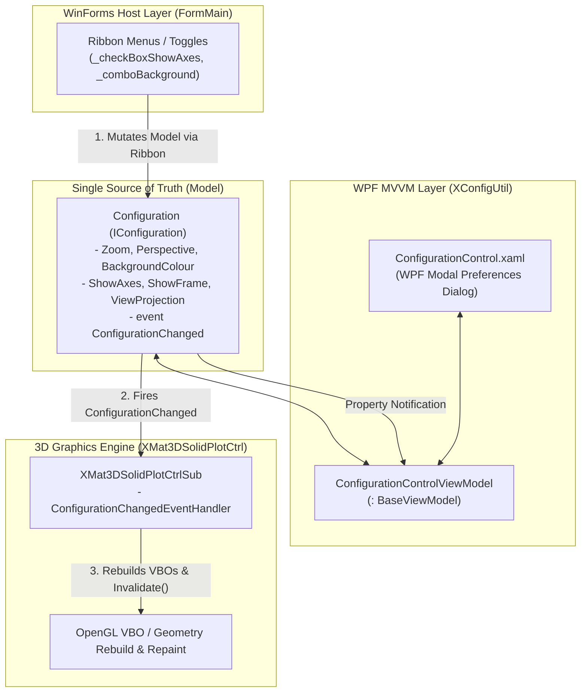

# [Part 5] XConfigUtil & Reusable Configuration Architecture for WinForms Engineers

> **Combining the directness of WinForms with the reusability of WPF MVVM: an architectural pattern driving parameter UI development costs down to zero across new projects.**

---

## 1. Background: Industrial WinForms Coexisting with WPF

In semiconductor fabrication and automated inspection equipment control, **C# Windows Forms** remains a mainstream choice thanks to its intuitive event-driven paradigm, rapid execution speeds, and battle-tested P/Invoke driver interfacing.

However, as machinery features grow increasingly complex, two recurring pain points emerge:
* **Repeatedly creating modal dialogs (`FormRename.cs`, etc.)** whenever text input is needed (renaming parts, creating assemblies, feature renaming).
* **The overhead of redesigning parameter panels** (sliders for 3D camera zoom, perspective field-of-view, projection modes, background colors, axis toggles) every time a new machine project is kicked off.

**`XConfigUtil`** was engineered as a **WPF-based shared MVVM and system utility library** specifically designed to solve this dilemma.

---

## 2. Overcoming the MVVM Friction for WinForms Developers

### 1) Why Does MVVM Feel Unintuitive to WinForms Engineers?
* **Imperative (Direct Action) vs. Declarative (Indirect Notification)**:
  WinForms is delightfully straightforward: `txtPart.Text = "Chuck";` or `panel.Visible = chk.Checked;`. MVVM, by contrast, operates indirectly: you alter a backing field and invoke `NotifyPropertyChanged`, letting the framework asynchronously reflect the change in the UI.
* **Disconnected F12 Call Stacks**:
  Clicking a button in WinForms jumps straight to the event handler in code. In MVVM, the click is mediated by an XAML `{Binding Command}` string through the runtime binding engine, breaking immediate linear code navigation.
* **Boilerplate Overhead**:
  Even a simple visibility toggle demands a ViewModel property, a `NotifyPropertyChanged` call, a `ValueConverter` class, an XAML resource declaration, and a binding markup expression.

### 2) The Modern Paradigm: Leveraging AI Pair Programming
The key to thriving with MVVM today is **delegating mechanical boilerplate (XAML markup, binding wiring, converters) to AI**, enabling the software engineer to **reap the ultimate rewards of MVVM: clean separation of concerns and automated cross-screen data synchronization**.

---

## 3. `Configuration` as the Single Source of Truth (SSOT)

The defining architectural achievement of `XMat3DSolidPlot` is that **a single `Configuration` instance acts as the Single Source of Truth** across the entire application ecosystem.



### Real-Time Cascade Workflow
1. **User Action**: The operator alters a background color or toggles coordinate frames in the WPF preferences popup.
2. **ViewModel Propagation**: Two-way XAML data binding triggers the setter on `ConfigurationControlViewModel`.
3. **Model Notification**: `Configuration.cs` fires `ConfigurationChanged?.Invoke(...)`.
4. **OpenTK Viewport Reacts**: `XMat3DSolidPlotCtrlSub` receives the event, triggers `RefreshVertexBuffers()` and `Invalidate()`, repainting the 3D scene in real-time at 60 FPS.
5. **Host UI Synchronization**: WinForms ribbon controls share the exact same `_modelConfig` reference, guaranteeing zero state divergence between separate panels.

---

## 4. The Standard 4-Tier Blueprint: 100% Reusable for New Controls

This architectural blueprint can be duplicated across any new industrial automation control (cameras, motors, lights, vision inspectors):

```
[New Custom Control Project]
 ├── 1. Model\I...Configuration.cs  → [Parameters + ConfigurationChanged Event + Load/Save]
 ├── 2. Control\MyCustomCtrl.cs     → [Subscribes to Event & Updates Hardware / Rendering]
 ├── 3. View\ConfigControl.xaml     → [XConfigUtil-Powered WPF Tabbed UI & ViewModel]
 └── 4. Exports.cs                  → [Show...ConfigurationDialog(config, handle) Entry Point]
```

### Prime Industrial Applications

| Domain | Control Name | Configuration Parameters |
| :--- | :--- | :--- |
| **2D Machine Vision** | `CameraViewCtrl` | Exposure time, Gain, Frame rate, Grid overlay, Zoom/Pan scaling |
| **Motion Control** | `MotionStageCtrl` | Jog feed rates, Accel/Decel ramps, Soft limits, Home datum offsets |
| **Industrial Lighting** | `LightControllerCtrl` | Channels 1-4 intensity (0-255), Strobe pulse width, COM baud rate |
| **Metrology Algorithms** | `InspectRecipeCtrl` | Binary threshold, Filter kernel size, Min/Max bounding area, Tolerances |

---

## 5. Summary: Zero-Cost Parameter UI Deployment

* **Zero Marginal UI Cost for New Projects**:
  Starting a new inspection station requires only referencing the compiled DLL and invoking `Exports.ShowSolidConfigurationDialog()`—a complete, production-ready configuration window is instantly available.
* **Automated Serialization Standards**:
  The unified `IConfiguration.Save()` and `Load()` interfaces ensure consistent XML/INI parameter persistence across every machine in the fleet.
* **Unified Factory-Floor UX**:
  Operators encounter identical hotkeys, navigation conventions, and styling across all equipment software, dramatically reducing training costs and operational errors.
