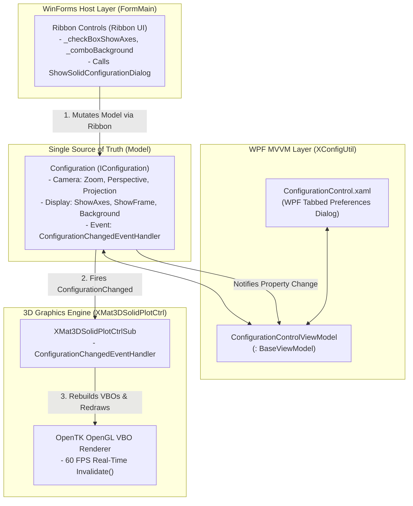

# Configuration & XConfigUtil Architecture Specification

> **Single Source of Truth (SSOT) data model driving real-time 3-way synchronization and turn-key component reusability across industrial applications.**

---

## 1. Architectural Overview

A cornerstone of the `XMat3DSolidPlot` and `XMat3DSolidWork` architecture is that **"all 3D viewport parameters and visualization states are managed by a single model (`Configuration`), and all UI controls and rendering pipelines observe this model."**

This allows the WinForms ribbon menu, the WPF modal preferences window, and the OpenTK OpenGL graphics engine to synchronize their states in real-time without direct coupling:



---

## 2. `IConfiguration` Model Specification

`XMat3DSolidPlot.Model.IConfiguration` abstracts all visual and geometric parameters of the 3D viewport.

### 1) Core Managed Properties

| Category | Property | Type | Default | Description |
| :--- | :--- | :--- | :--- | :--- |
| **Camera** | `Zoom` | `int` | `100` | Camera magnification scale (1 to 500) |
| | `Perspective` | `float` | `100.0f` | Perspective distance and focal angle |
| | `ViewProjection` | `ViewProjection` | `ThreeDimensional` | 3D Perspective, Orthographic Front, Side, Top |
| **Coordinates** | `ShowAxes` | `bool` | `true` | Toggles 3D Cartesian datum axes (X, Y, Z) |
| | `ShowAxesTitles` | `bool` | `false` | Renders text axis labels |
| | `ShowMiniAxes` | `bool` | `true` | Renders top-left interactive mini axis indicator |
| | `ShowBaseCornerAxes` | `bool` | `true` | Corner datum coordinate axis indicator |
| **Frame** | `ShowFrame` | `bool` | `true` | Bounding chamber wireframe enclosure |
| | `FrameColour` | `string` | `"White"` | Bounding frame stroke color |
| **Theming** | `BackgroundColour` | `string` | `"Black"` | Viewport background (`BlanchedAlmond`, etc.) |
| | `LabelFontSize` | `int` | `10` | Font size for 3D coordinate labels |
| | `WorkOnFace` | `bool` | `false` | Enables click-to-sketch planar face mode |

### 2) Event Notification Mechanism
```csharp
public delegate void ConfigurationChangedEventHandler(ConfigurationItem configurationItem);

public interface IConfiguration
{
    event ConfigurationChangedEventHandler ConfigurationChanged;
    // ... property declarations ...
}
```
Every property setter executes `ConfigurationChanged?.Invoke(ConfigurationItem.xxx)`, delivering fine-grained itemized updates to all registered subscribers.

---

## 3. OpenTK 3D Graphics Engine Reaction Pipeline

`XMat3DSolidPlotCtrlSub` subscribes to `IConfiguration.ConfigurationChanged` during control instantiation and executes minimal, targeted updates:

```csharp
public void ConfigurationChangedEventHandler(ConfigurationItem configurationItem)
{
    try
    {
        switch (configurationItem)
        {
            // 1. Recalculate geometric bounds & coordinate axes
            case ConfigurationItem.ShowAxes:
            case ConfigurationItem.ShowCoordPlanes:
            case ConfigurationItem.ShowFrame:
            case ConfigurationItem.ViewProjection:
                ConfigureSolidWorkspace(_solidWorkspaceWidth, _solidWorkspaceHeight, _solidWorkspaceMinZ, _solidWorkspaceMaxZ);
                break;

            // 2. Re-upload GPU vertex buffers and text textures
            case ConfigurationItem.BackgroundColour:
            case ConfigurationItem.LabelFontSize:
                RefreshVertexBuffers();
                break;
        }
    }
    catch { }

    // 3. Request 60 FPS viewport repaint
    Invalidate(ClientRectangle);
}
```

---

## 4. WPF MVVM & XConfigUtil Binding Layer

The WPF preferences dialog utilizes **`XConfigUtil`** primitives to render modern sliders, trackbars, and comboboxes:

1. **`BaseViewModel` Inheritance**:
   `ConfigurationControlViewModel` inherits from `XConfigUtil.ViewModel.BaseViewModel`, providing standardized `INotifyPropertyChanged` dispatching.
2. **Pre-Built `ValueConverters`**:
   XAML markup cleanly toggles control visibility (`EnumToVisibilityConverter`, `InverseBooleanToVisibilityConverter`) without procedural glue code.
3. **WinForms ↔ WPF Interop**:
   ```csharp
   // Displays WPF modal window owned by WinForms window handle
   WindowInteropHelper helper = new WindowInteropHelper(configurationView);
   helper.Owner = ownerHandle;
   configurationView.Show();
   ```

---

## 5. Serialization & State Persistence

`IConfiguration` provides unified serialization contracts:

```csharp
public void Load(IConfigurationSerialiser serialiser)
{
    Zoom = serialiser.ReadEntry("Zoom", Zoom);
    BackgroundColour = serialiser.ReadEntry("BackgroundColour", "Black");
    ShowAxes = serialiser.ReadEntry("ShowAxes", ShowAxes);
    // ...
}

public void Save(IConfigurationSerialiser serialiser)
{
    serialiser.WriteEntry("Zoom", Zoom);
    serialiser.WriteEntry("BackgroundColour", BackgroundColour);
    serialiser.WriteEntry("ShowAxes", ShowAxes);
    // ...
}
```
Whether persisting to an XML `.m3d` document or an `XMat3DSolidWork.ini` configuration file, settings serialize losslessly through a single shared format.

---

## 6. The Standard 4-Tier Blueprint: 100% Reusable for New Controls

This architectural blueprint can be duplicated across any new industrial automation control (2D cameras, motion stages, strobe lights, vision inspection recipes):

```
[New Custom Control Project]
 ├── 1. Model/I...Configuration.cs  → Parameters + Changed Event + Load/Save
 ├── 2. Control/MyCustomCtrl.cs     → Listens to Event & Updates Hardware/Rendering
 ├── 3. View/ConfigControl.xaml     → XConfigUtil-Powered WPF Tabbed UI & ViewModel
 └── 4. Exports.cs                  → Show...ConfigurationDialog() Static Entry Point
```

### Summary of Benefits
* **Zero Marginal UI Cost**: New applications do not need to rewrite sliders, comboboxes, or color pickers—the entire dialog is delivered turn-key with the component.
* **Unified Factory-Floor UX**: Operators encounter identical hotkeys, navigation conventions, and visual styling across all inspection software.
