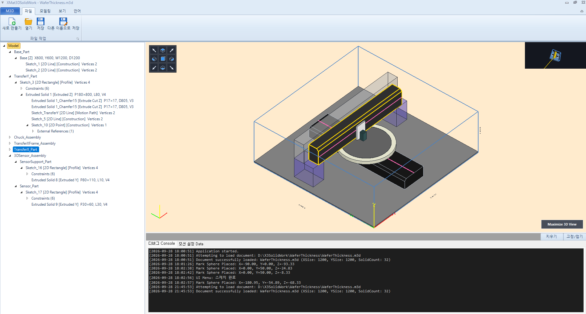
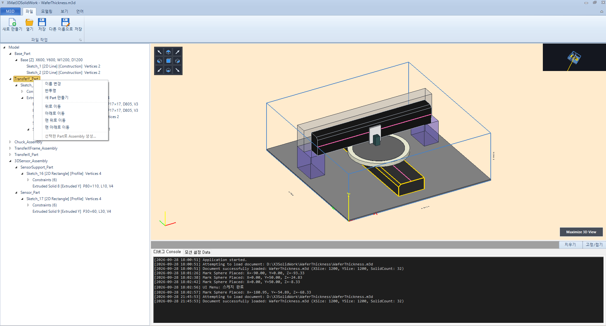
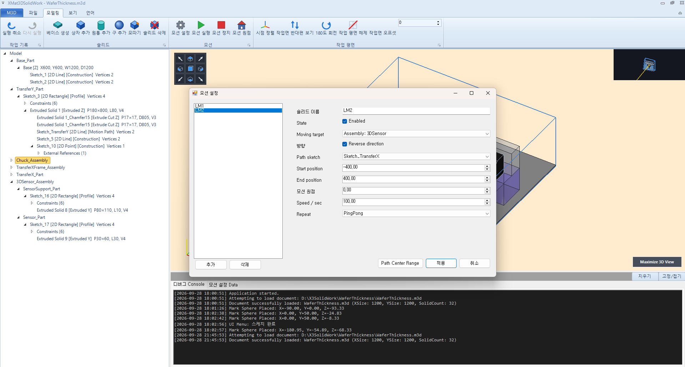
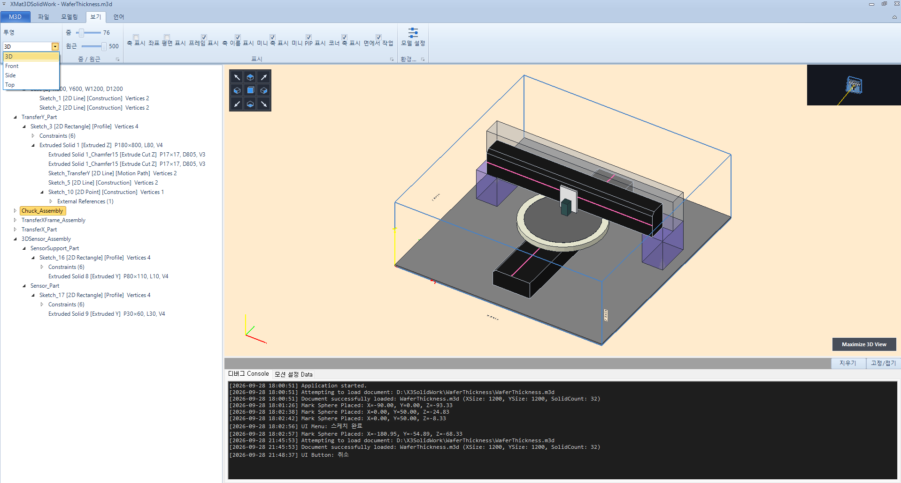
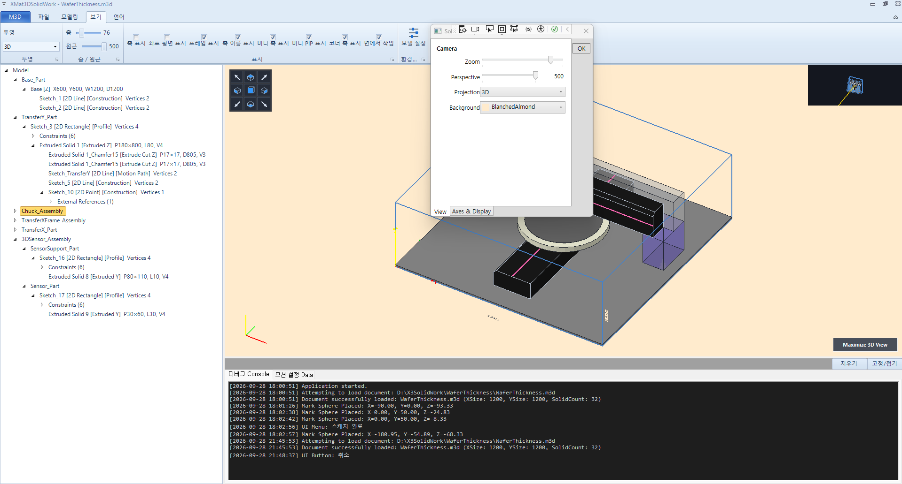
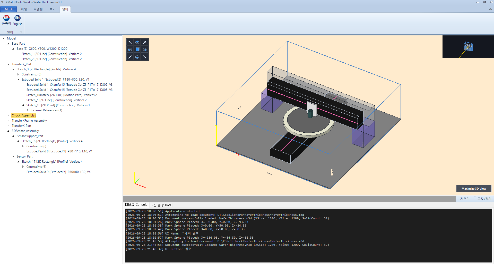

# 주요 기능 & UI 둘러보기 (Features Overview)

XMat3DSolidWork는 복잡한 반도체 검사 장비의 3D 기구 모델링과 다축 서보 모션을 직관적으로 제어·검증할 수 있도록 설계된 독자적인 독립형 3D CAD 시스템입니다.

실제 프로그램 구동 화면(1 ~ 9)을 통해 주요 기능과 UI 구조를 상세히 살펴봅니다.

---

### 1. 메인 뷰포트 & [파일] 탭 (File Operations)

* **상단 [파일] 리본 탭**:
  * `새로 만들기`, `열기`, `저장`, `다른 이름으로 저장`: 독자적인 `.m3d` XML 규격으로 솔리드 파라미터, 2D 스케치 기하 구속조건, 어셈블리/파트 계층 트리 및 모션 티칭 데이터를 무손실 직렬화하여 저장하고 복원합니다.
* **좌측 계층 트리뷰 (Model Hierarchy)**:
  * 최상위 `Model` 아래 `Base_Part`, `TransferY_Part`, `Chuck_Assembly`, `TransferX_Part`, `3DSensor_Assembly` 등 독립 부품과 기구 어셈블리가 시각적 계층으로 정돈되어 표시됩니다.
* **중앙 3D OpenTK 뷰포트**:
  * 선택된 부품(솔리드)의 실시간 하이라이트(노란색 외곽선), 검사 챔버 바운딩 프레임, 회전 척(Chuck), 갠트리 이송 레일 및 3D 변위 센서 헤드를 60FPS로 고속 렌더링합니다.
  * 좌측 상단 인터랙티브 3D **뷰 큐브(View Cube)** 및 우측 상단 **PiP(Picture-in-Picture) 미니 뷰포트**가 연동되어 다각도 시점 상태를 한눈에 파악할 수 있습니다.
* **하단 도킹 패널**:
  * `디버그 Console`: 모델 로드, 기하 연산, 구속조건 해석 로그 실시간 출력
  * `모션 설정 Data`: 축별 조그 제어 및 티칭 위치 데이터 패널

---

### 2. Part 컨텍스트 메뉴 (부품 관리 & 어셈블리 생성)

* **트리뷰 Part 우클릭 메뉴**:
  * **이름 변경 (Rename)**: 파트 고유 명칭 변경 (`TransferY_Part` 등)
  * **반투명 (Semi-Transparent)**: 복합 기구 내부 간섭 및 센서 위치를 확인하기 위한 파트 단위 투명도 토글
  * **새 Part 만들기**: 새로운 독립 부품 컨테이너 생성
  * **트리 순서 이동 (Reorder)**: `위로 이동`, `아래로 이동`, `맨 위로 이동`, `맨 아래로 이동`을 통해 모델 트리 계층 순서 정리
  * **선택한 Part로 Assembly 생성**: 복수의 파트를 선택하여 독립 구동 단위인 상위 Assembly로 즉각 그룹화

---

### 3. Assembly 컨텍스트 메뉴 (기구 어셈블리 관리)

* **어셈블리 우클릭 메뉴**:
  * **이름 변경**: `Chuck_Assembly`, `3DSensor_Assembly` 등 장비 구동 유닛 단위 명칭 지정
  * **반투명 시각화**: 어셈블리 전체에 속한 모든 하위 파트와 솔리드를 일괄 반투명 렌더링하여 내부 기구 구조 검증
  * **계층 순서 제어**: 어셈블리 간의 트리 순서 조정

---

### 4. [모델링] 탭 리본 메뉴 (Modeling & Work Plane)

* **작업 기록 (History)**: `실행 취소(Undo)` 및 `다시 실행(Redo)` 다단계 히스토리 스택 지원
* **솔리드 생성 (Solids)**:
  * `베이스 생성`: 장비 지지용 기준 베이스 블록 생성
  * `상자 추가`, `원통 추가`, `구 추가`: 3D 프리미티브 솔리드 기본 생성
  * `모따기(Chamfer)`: 솔리드 모서리 C-모따기 가공 연산
  * `솔리드 삭제`: 선택한 기하 피처 제거
* **모션 제어 (Motion)**:
  * `모션 설정`: 다축 서보 축 매핑 및 파라미터 대화상자 호출
  * `모션 실행` / `모션 정지`: 실시간 다축 기구 시뮬레이션 시작/중지
  * `모션 원점`: 모든 축을 홈(Home) 위치로 일괄 복귀
* **작업 평면 도구 (Work Plane)**:
  * `시점 정렬`: 작업 평면을 뷰포트 정면과 수직으로 자동 정렬
  * `작업면 반대편 보기`: 평면 뒷면 180° 시점 반전
  * `180도 회전`: 평면 축 기준 180° 회전
  * `작업 평면 해제` 및 `작업면 오프셋`: 작업 평면을 법선 방향으로 미세 오프셋 이동

---

### 5. 모션 설정 - LM1 축 정의 (Chuck Y축 이송)

* **CAD 스케치 라인 기반 서보 축 정의 (LM1)**:
  * **Moving Target**: 구동 대상 어셈블리 지정 (`Assembly: Chuck`)
  * **Path Sketch**: 이동 궤적 레일이 되는 스케치 라인 지정 (`Sketch_TransferY`)
  * **이동 범위**: 시작 위치(`-400.00mm`) ~ 종료 위치(`400.00mm`), 모션 원점(`0.00mm`)
  * **구동 파라미터**: 속도(`100.00 mm/s`), 반복 방식(`PingPong` 왕복 주행)
  * **Path Center Range**: 스케치 라인의 중심을 기준으로 이동 범위 자동 계산

---

### 6. 모션 설정 - LM2 축 정의 (3D Sensor X축 이송)

* **다축 서보 연동 정의 (LM2)**:
  * **Moving Target**: 상단 센서 어셈블리 지정 (`Assembly: 3DSensor`)
  * **Path Sketch**: 직교하는 X축 레일 스케치 지정 (`Sketch_TransferX`)
  * **방향 반전(Reverse direction)**: 실제 서보 모터의 방향과 일치하도록 궤적 부호 반전
  * LM1(척 Y 이송)과 LM2(센서 X 이송)가 동시에 독립 연동되어 실제 검사 장비의 2축 스캔 궤적을 3차원으로 완벽하게 재현합니다.

---

### 7. [보기] 탭 리본 메뉴 (Display & Projection Options)

* **투영 방식 (Projection)**: 드롭다운을 통해 `3D(원근 투시)` 및 `Front(정면)`, `Side(측면)`, `Top(평면)` 직교 투영 즉시 전환
* **카메라 슬라이더**: `줌(Zoom)` 배율 및 `원근(Perspective)` 화각 미세 조절
* **세부 표시 체크박스 (Display Toggles)**:
  * `축 표시` / `좌표 평면 표시` / `프레임 표시` / `축 이름 표시`
  * `미니 축 표시` / `미니 PiP 표시` / `코너 축 표시`
  * `면에서 작업(Work on Face)`: 솔리드 임의의 면을 클릭하여 즉시 스케치 평면으로 지정하는 모드 활성화

---

### 8. 모델 환경 설정 다이얼로그 (Camera & Background)

* **Camera 세부 제어**:
  * 줌 및 원근감(Perspective 거리 500) 정밀 제어
  * 투영 방식 및 배경색(`BlanchedAlmond` 등 장비 환경에 최적화된 배경 팔레트 선택)
* **Axes & Display 탭**:
  * 기구 좌표계 축 길이, 텍스트 폰트 크기, 음영 렌더링 스타일 상세 설정

---

### 9. [언어] 탭 리본 메뉴 (다국어 지원 & 영속화)

* **원클릭 실시간 다국어 전환**:
  * **한국어 (KR)** 및 **English (EN)** 버튼을 누르는 즉시 재시작 없이 모든 리본 메뉴, 툴팁, 트리 컨텍스트 메뉴, 다이얼로그 텍스트가 해당 언어로 전환됩니다.
  * 변경된 언어 설정은 `XMat3DSolidWork.ini` 파일에 자동 저장되어 프로그램을 종료하고 다시 켜도 설정한 언어가 그대로 영속 유지됩니다.
